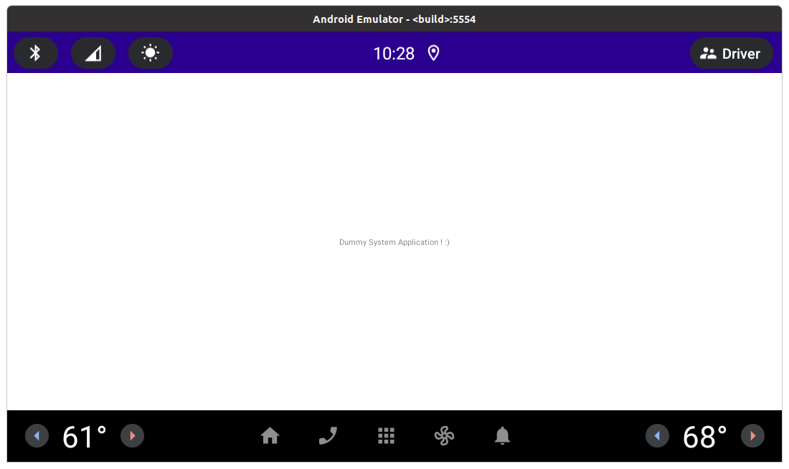
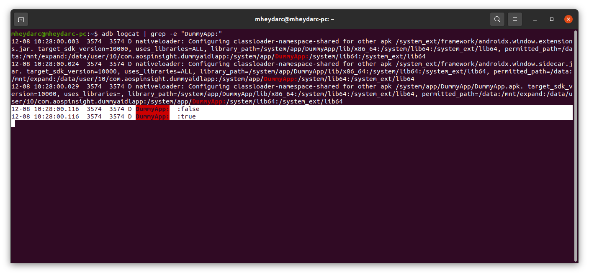

# Android-priv-app
## An example of how to develop a system app in AOSP

  

### This repo will show how you can add an Android app to AOSP from scratch to AOSP and how to add required SELinux policies and the configurations to build it

## Building AOSP

#### If you havn't cloned and set up AOSP locally you can read the article below:
[How to build AOSP](https://aospinsight.com/how-to-build-aosp/)

#### After cloning the repo create a new folder inside AOSP and rename it to "vendor". Then copy "aospinsight" folder to "vendor".